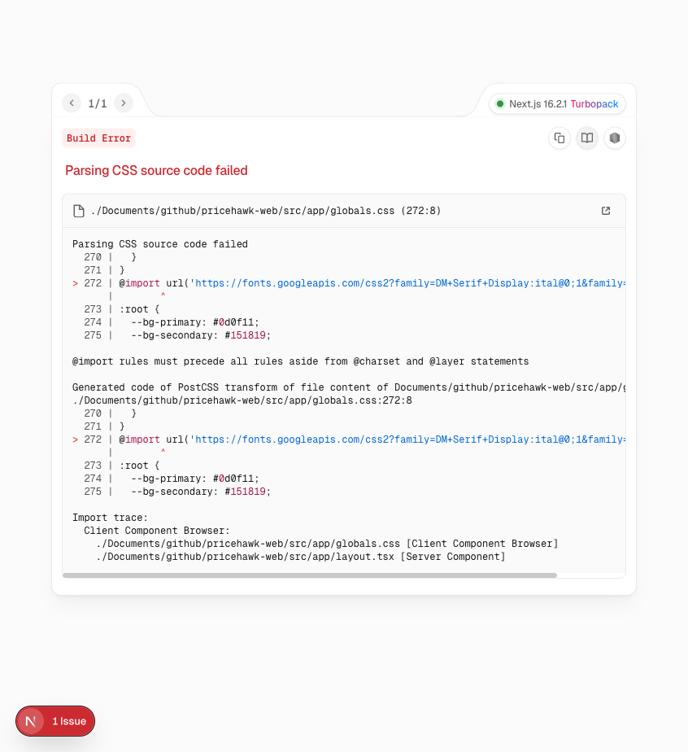
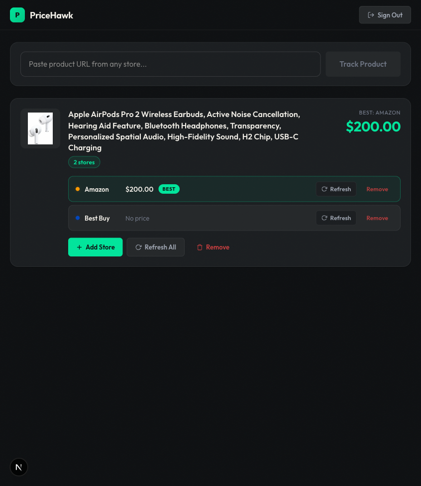
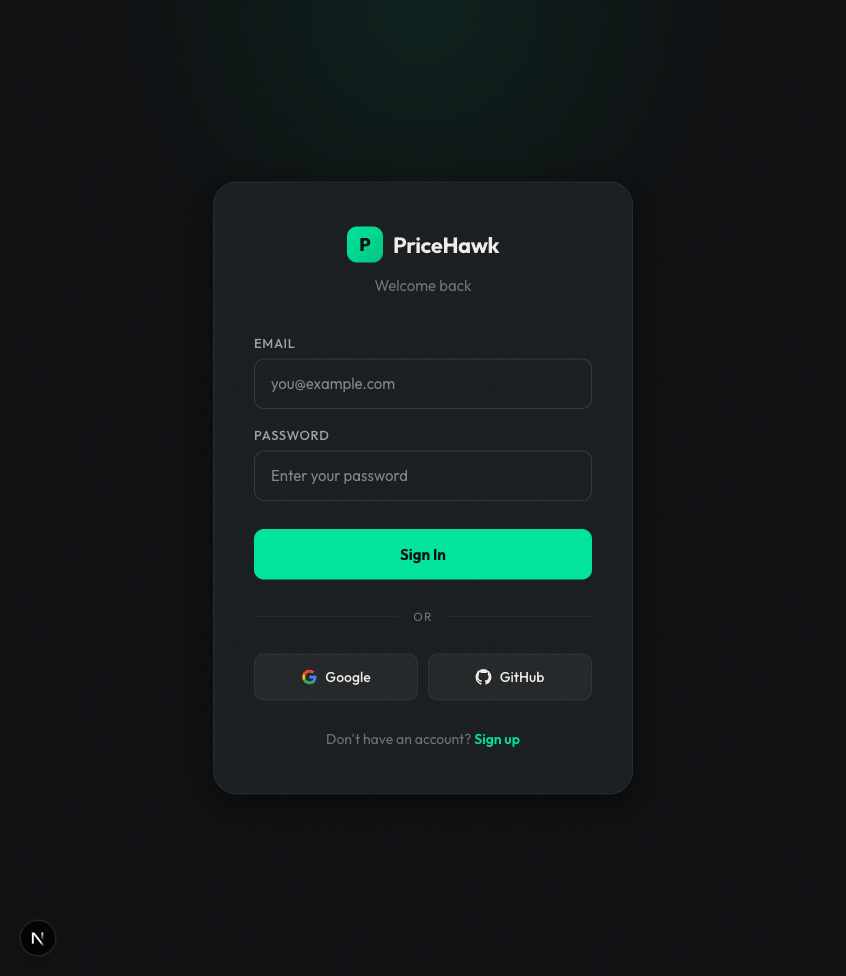
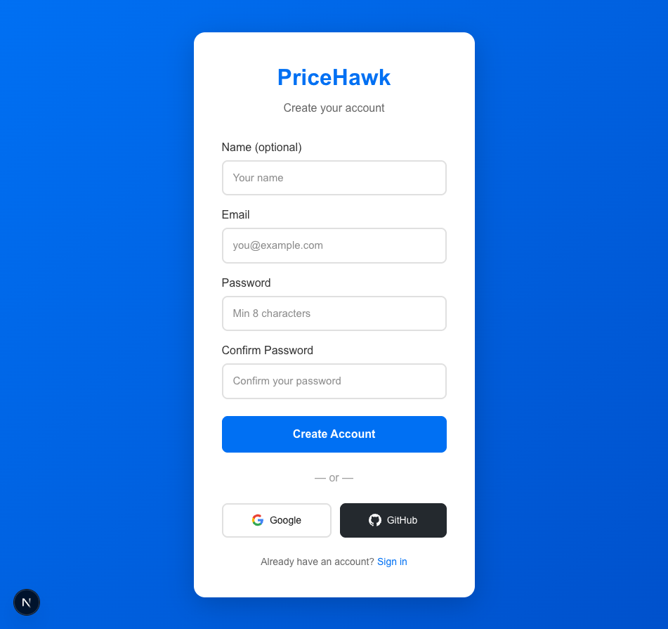
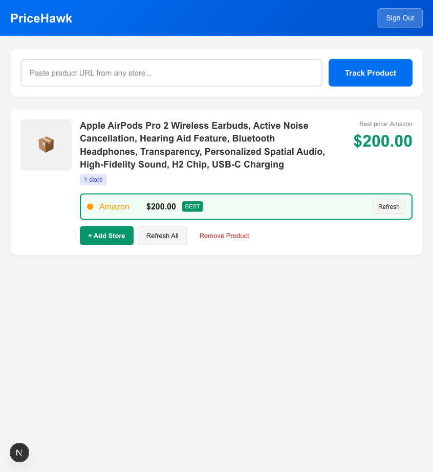

# PriceHawk

> Never overpay for anything again.

PriceHawk is a price tracking web application that monitors products across major retailers and notifies you when prices drop. It features an interactive dashboard, historical price charts, and a browser extension for one-click tracking.

---

## Screenshots

<p align="center">
  
</p>

### Dashboard

Track products, view price history, and see savings at a glance.

<p align="center">
  
</p>

### Price History

Interactive charts showing price trends over time.

<p align="center">
  
</p>

### Signup & Authentication

Simple, secure user accounts to manage your tracked products.

<p align="center">
  
  
</p>

### Add & Track Products

Paste a product URL from any supported store to start tracking instantly.

<p align="center">
  
</p>

---

## Features

- **Multi-Store Tracking** — Monitor the same product across Amazon, Walmart, Best Buy, Target, eBay, Costco, GameStop, Newegg, and B&H Photo.
- **Price History** — Historical charts powered by Recharts reveal trends so you buy at the right time.
- **Price Alerts** — Get notified the second a product drops below your target price.
- **One-Click Browser Extension** — Browse any supported store, click the extension, and the product is instantly added to your dashboard.
- **Private & Secure** — Your data stays yours. No tracking, no selling your info.

---

## Tech Stack

- **Framework**: [Next.js 16](https://nextjs.org/) (App Router)
- **Frontend**: React 19, TypeScript, Tailwind CSS 4
- **Authentication**: [NextAuth.js v5](https://nextjs.authjs.dev/) (beta)
- **Database**: PostgreSQL + [Prisma ORM](https://www.prisma.io/)
- **Charts**: [Recharts](https://recharts.org/)
- **Scraping**: Puppeteer + Cheerio + ScraperAPI
- **Browser Extension**: Manifest V3 (Chrome)

---

## Getting Started

### Prerequisites

- Node.js 20+
- PostgreSQL database
- ScraperAPI key (for production scraping)

### Installation

```bash
# Clone the repository
git clone git@github.com:TOX9C/price-tracker.git
cd price-tracker/pricehawk-web

# Install dependencies
npm install

# Set up environment variables
cp .env.example .env.local
# Edit .env.local with your DATABASE_URL, DIRECT_URL, and NEXTAUTH_SECRET

# Generate Prisma client and run migrations
npx prisma generate
npx prisma migrate dev

# Run the development server
npm run dev
```

Open [http://localhost:3000](http://localhost:3000) with your browser.

### Environment Variables

| Variable | Description |
| --- | --- |
| `DATABASE_URL` | PostgreSQL connection string (with PgBouncer) |
| `DIRECT_URL` | Direct PostgreSQL connection (for migrations) |
| `NEXTAUTH_SECRET` | Secret for NextAuth session encryption |
| `SCRAPER_API_KEY` | ScraperAPI key for production web scraping |

---

## Project Structure

```
pricehawk-web/
├── src/
│   ├── app/                  # Next.js App Router pages
│   │   ├── api/              # API routes (NextAuth, products, listings)
│   │   ├── dashboard/        # Dashboard and product detail pages
│   │   ├── login/            # Login page
│   │   ├── signup/           # Signup page
│   │   └── page.tsx          # Landing page
│   ├── components/           # Reusable React components
│   │   ├── DashboardHeader.tsx
│   │   ├── Logo.tsx
│   │   └── ProductCard.tsx
│   ├── lib/                  # Utilities, auth, database, scrapers
│   │   ├── auth.ts           # NextAuth configuration
│   │   ├── db.ts             # Prisma client
│   │   ├── rate-limit.ts     # Rate limiting
│   │   ├── scrapers/         # Web scraping logic
│   │   └── utils/            # Product helpers
│   └── types/                # TypeScript type declarations
├── extension/                # Browser extension (Manifest V3)
│   ├── manifest.json
│   ├── popup.html
│   ├── popup.js
│   ├── content.js
│   ├── background.js
│   └── icons/
├── prisma/
│   ├── schema.prisma         # Database schema
│   └── migrations/           # Database migrations
├── public/                   # Static assets
└── vercel.json               # Vercel deployment config
```

---

## Supported Stores

- Amazon
- Walmart
- Best Buy
- Target
- eBay
- Costco
- GameStop
- Newegg
- B&H Photo

> Plus a generic fallback for any store with visible pricing.

---

## License

MIT © 2026 PriceHawk
